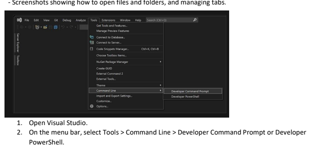
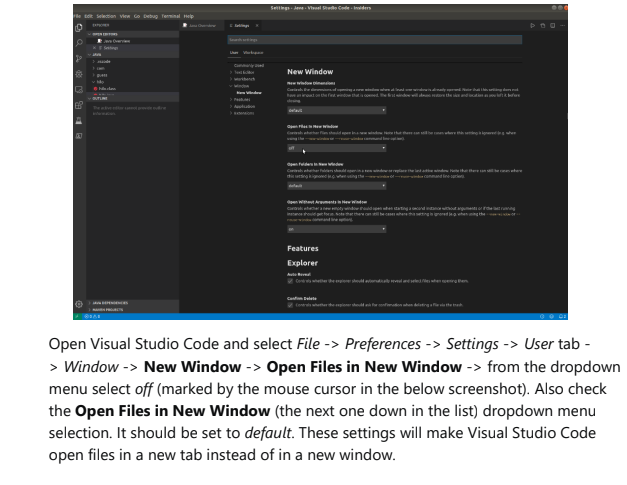
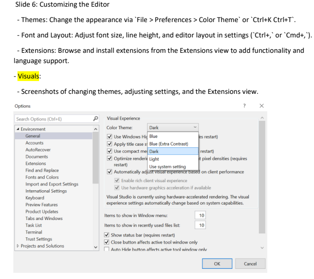
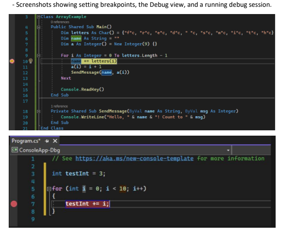

# SE-Assignment-5
Installation and Navigation of Visual Studio Code (VS Code)
 Instructions:
Answer the following questions based on your understanding of the installation and navigation of Visual Studio Code (VS Code). Provide detailed explanations and examples where appropriate.

 Questions:

1. Installation of VS Code:
   - Describe the steps to download and install Visual Studio Code on Windows 11 operating system. Include any prerequisites that might be needed.

   Visual studio code requires a 1.6 GHz or faster processor and a 1 GB of RAM

   To download and install visual studio code;
   . Download the VS Code file from the official website (https://code.visualstudio.com/)
   . Execute the download file
   . Accept the terms and conditions
   . Download installer:click on the "Download for windows" button to download the installer file
   . Wait for installation to complete
   . Once the installation is complete , locate the downloaded installer file (usually in my downloads folder) and double-click on it to run it
   . Installation Wizard: Follow the prompts in the installation wizard.One can choose the installation location and whether to add VS Code to his PATH (environment variables) during the installation process
   . Completw installation: After the installation is complete, one can now launch visual studio code by double-clicking its shortcut icon on the desktop or by searching for "visual studio code" in the the start menu

2. First-time Setup:
   - After installing VS Code, what initial configurations and settings should be adjusted for an optimal coding environment? Mention any important settings or extensions.

   One can configure visual studio code to his liking through its various settings.Nearly every part of VS Code's editor, user interface, and fuctional behaviour has options one can modify.

   VS Code provides different scopes for settings:
    . User settings-Settings that apply globally to any instance of VS Code one opens
    . Workspace settings-Settings stored inside my workspace and only apply when the workspace is opened

    Extension settings- Installed VS Code extensions can also contribute their own settings, which one can review under the Extensions section of the settings editor

3. User Interface Overview:
   - Explain the main components of the VS Code user interface. Identify and describe the purpose of the Activity Bar, Side Bar, Editor Group, and Status Bar.

   On VS Code, the main component include-
   Editor-This is the main area to edit my files.I can open as many editors as i can like side by side vertically and horizontally.

   Activity bar-Is located on the left side and it provides access to different views like Explorer,Search,Source Control,Run, and Extensions

   Side Bar-Displays different views and their contents, like the file explorer

   Editor Group-This is where to edit my files. Multiple files can be opened in tabs

   Status Bar-Is located at the bottom and shows information about files and projects

4. Command Palette:
   - What is the Command Palette in VS Code, and how can it be accessed? Provide examples of common tasks that can be performed using the Command Palette.

   A Command palette component in a SaaS(Software as a Service) web app is a powerful interface element that allows users to perform actions more efficiently by typing commands.

   Command palette is accessed via 'Ctrl+Shift+P' on windows and allows one to run commands.

   A Command Palette provides access to many commands. One can run editor commands, open files, search for symbols, and see a quick outline of a file, all using the same interactive window.

5. Extensions in VS Code:
   - Discuss the role of extensions in VS Code. How can users find, install, and manage extensions? Provide examples of essential extensions for web development.

   VS Code extensions allows one to  add languages, debuggers, and tools to his installation to support his development workflow. VS Code's rich extensibility model lets extension authors plug directly into the VS Code UI and contribute fuctionality through the same APIs used by VS Code.

   One can browse and install extensions from within VS Code. Bring up the Extensions view by clicking on the Extensions icon in the Activity Bar on the side of VS Code or the View: Extensions command (Ctrl+Shift+X). This will show one a list of most popular VS Code extensions on the VS Code Marketplace. These extensions add support for new languages, provide additional tools, and enhance once overloll development experience. 

   Examples of essential extensions for web development are; 
   . prettier-Code Formatter
   . Javascript Booster
   . ESLint
   . Gitlens
   . Live Server
   . CSS Peek
   . IntelliSense for CSS class names in HTML
   . JavaScript (ES6) Code Snippets
   . IntelliCode
   . VS Code

6. Integrated Terminal:
   - Describe how to open and use the integrated terminal in VS Code. What are the advantages of using the integrated terminal compared to an external terminal?

   VS Code comes with a built-in terminal, allowing one to run commands,compile and perform other tasks without leaving the editor which is a great advantage

   Open the terminal using 'Ctrl+' for windows
   It supports multiple terminal sessions
   We use the terminal for running scrips, version control commands,and more

7. File and Folder Management:
   - Explain how to create, open, and manage files and folders in VS Code. How can users navigate between different files and directories efficiently?

     

     

 The File>Add Folder to Workspace command brings up an ocean Folder dialog to select the new folder. Once a root folder is added, the Explore will show the folder as a root in the File Explorer. One might Right-click on any of the root folders and use the context menu to add or remove folders.

8. Settings and Preferences:
   - Where can users find and customize settings in VS Code? Provide examples of how to change the theme, font size, and keybindings.

     

   One uses the Settings editor to review and change VS Code settings. To open the Settings editor, navigate to File>Preferences>Settings. Alternatively,open the Settings editor from the Command palette (Ctrl+Shift+P) with preferences: Open Settings or use the keyboard shortcut(Ctrl+)

   One can change the fonts and colors in visual studio in several ways. For example, one can change the default dark theme (also referred to as "dark mode") to a light theme, a blue theme, an extra-contrast theme, or a theme that matches once system settings. One can also change the default font and text size in both the IDE and the code editor

9. Debugging in VS Code:
   - Outline the steps to set up and start debugging a simple program in VS Code. What are some key debugging features available in VS Code?

     Debugging Code:
       .Setting Up: Configure debugging settings in 'launch.json'
       . Breakpoints: Set breakpoints by clicking in the gutter next to line numbers
       .  Debug View: Access debug controls from the Activity Bar
       . Running and inspecting: Start debugging session, inspect variables, step through code, and 

       

       Many debuggers support some of the following attributes:
       . Program- executable or file to run when launching the debugger
       . args- arguments passed to the program  to debug
       . env- environment variables ( the value null can be used to "undefine" a variable)
       . envFile-path to dotenv file with environment variables

10. Using Source Control:
    - How can users integrate Git with VS Code for version control? Describe the process of initializing a repository, making commits, and pushing changes to GitHub.

       .If your workspace is on your local machine.
       .One can enable Git Source control by creating a Git repository with the initialize Repository command. When VS Code doesn't detect an existing Git repository, the Source Control view will give you the options to initialize Repository or publish to GitHub

       . Open Terminal Terminal Git Bash
       . Navigate to the root directory of your project
       . Initialize the local directory as Git repository. By default, the initial branch is called main.
       . Add the files in your new local repository
       . Commit the files that you've staged in your local repository

 Submission Guidelines:
- Your answers should be well-structured, concise, and to the point.
- Provide screenshots or step-by-step instructions where applicable.
- Cite any references or sources you use in your answers.
- Submit your completed assignment by 1st July 

